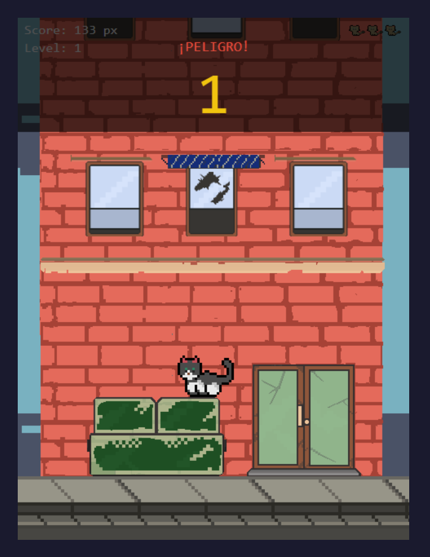

# Soggy Moggy

A vertical platformer in the browser. A stuffed cat jumps from platform to platform, fleeing a rising threat from below. Three levels, three hazards: smog in the city, electricity in the elevator shaft, flooding at the lighthouse.

Final project at SRH Fachschule, Game & Multimedia Design (GME-24.01). Developer: Julian Gomez.

---

## Screenshot



> Placeholder: this image shows Level 1 (La Ciudad). For the final submission this can be swapped with another screenshot from `Screenshots/Levels/`.

---

## Gameplay

- Manual jump, no auto-bounce. Every platform is a deliberate decision.
- Three levels, each with its own rising hazard.
- Wasps as enemies: stomp them to kill, get stung to lose a life.
- One balloon collectible per level grants an extra life.
- In-game language: English (UI, HUD, dialogues).

---

## Controls

| Action | Input |
|:---|:---|
| Move left | `A` or `←` |
| Move right | `D` or `→` |
| Jump | `Space` or left-click |
| Action | `Z` or right-click |
| Pause | `Escape` |
| Confirm menu | `Enter` or left-click |
| Navigate menu | `↑` / `↓` |

Source: `src/input.js` (verified 2026-04-27). On German QWERTZ keyboards both the labeled Z key (physical position `KeyY`) and the labeled Y key (`KeyZ`) trigger the action — the action key works regardless of layout.

---

## How to Run

No installation, no build step.

1. Clone or unzip the repository.
2. Open `index.html` in a browser (tested in Chrome, Firefox, Edge).
3. Alternatively: the game will be hosted on GitHub Pages (Phase 7 of project planning).

A local web server is recommended (e.g. `python -m http.server`) so all PNG assets load without `file://` restrictions.

---

## Tech Stack

- JavaScript (ES2022+), HTML5, CSS for page layout only.
- HTML Canvas 2D API, 480 x 640 px resolution, portrait.
- HTMLAudio for music + SFX (file:// compatible on Firefox + Chromium). Web Audio API was evaluated and rejected because Firefox blocks the XHR / fetch needed to load buffers from `file://`.
- React + ReactDOM (UMD bundles via unpkg) for the Start, Pause, Game Over, Level Complete and Success screen overlays. JSX is intentionally not used: Babel-standalone needs XHR for external `<script src=>` files, which `file://` blocks. All overlay components use plain `React.createElement`.
- No build step, no bundler, no other external libraries.
- Pixel art: Pixelorama (`.pxo` sources), Adobe Photoshop for spritesheet composition.

---

## Project Structure

```
src/                  Game source code (JavaScript)
Visuals/             All sprites and source files
docs/                 Plans, style guide, asset list
Dokumente_Schule/     School documents, templates, completed forms
Screenshots/          Gameplay screenshots
index.html            Entry point
```

Full planning index: [`docs/plans/README.md`](docs/plans/README.md)

---

## AI assistance disclosure

Author: Julian Gomez. Developed with AI assistance (Claude / Anthropic) as a pair-programming partner for design, implementation, and debugging. All code was reviewed and integrated by the author.

The same wording appears as a header block in every `src/*.js` file and must match the corresponding declaration in `Dokumente_Schule/Ausgefuellt/Selbstständigkeitserklärung_Julian_Gomez.docx`.

---

## Credits

**Fonts**

Title font (bitmap): `Visuals/fonts/alphabet_pixel_retro_video_game_style.png`, derived from Vecteezy.com (Free License, attribution required). Used as YELLOW_FONT atlas in `src/dialogue.js` for dialogue titles.

Body font: `Visuals/fonts/BlockCraft.otf`, loaded via `@font-face` in `index.html`, used by `drawBodyText()` for dialogue body text. (Source + license: see `Dokumente_Schule/Completed/Medienkatalog.md`.)

Older and experimental fonts (black-LCD attempt, Vecteezy source files) are archived in `Visuals/fonts/Archive/`.

**Pixel Art**

All sprites, backgrounds, UI elements, enemies and platforms: original work by Julian Gomez, created in Pixelorama. Spritesheets assembled in Adobe Photoshop where noted.

**Dialogue Bubbles**

Vector source: `Visuals/thought_bubbles/dialogue_bubbles.ai` (Adobe Illustrator), original work. 8 bubble PNGs cropped to `Visuals/thought_bubbles/dialogues/` via `scripts/crop_bubbles.py`.

**Inspiration Material**

`Visuals/_dev/Inspiration/` contains reference images used as style studies only. None are used in the game.

Full media catalog: [`Dokumente_Schule/Medienkatalog.md`](Dokumente_Schule/Medienkatalog.md)

---

## License

School project, internal use only. No commercial use. No LICENSE file is included in the repository.

---

## Status and Related Documents

- Submission status for all school artifacts: [`Dokumente_Schule/ABGABE_STATUS.md`](Dokumente_Schule/ABGABE_STATUS.md)
- Planning index: [`docs/plans/README.md`](docs/plans/README.md)
- Game Design Document: [`Dokumente_Schule/Ausgefuellt/GDD_Julian_Gomez.md`](Dokumente_Schule/Ausgefuellt/GDD_Julian_Gomez.md)
- Asset list (code view): [`docs/ASSET_LIST.md`](docs/ASSET_LIST.md)
- Media catalog (submission view): [`Dokumente_Schule/Medienkatalog.md`](Dokumente_Schule/Medienkatalog.md)
- USB submission structure: [`Dokumente_Schule/USB-Abgabe-Struktur.md`](Dokumente_Schule/USB-Abgabe-Struktur.md)

Deadline: postponed, new date pending (as of 2026-04-22).
